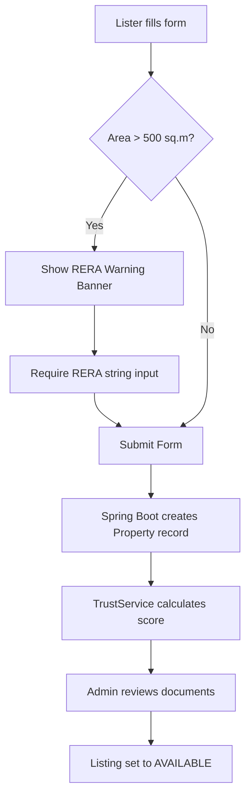

# NestIQ Industry Review Master Guide: Architecture, Workflows, & Evolution Roadmap

This comprehensive document serves as the core technical reference and defense manual for the NestIQ Smart Real Estate Platform. Designed for the upcoming industry review, it details the platform's current implementation, architecture, real-world problems solved, code workflows, evolution plans, and a 50-question reviewer defense prep bank.

---

# PART 1: "How NestIQ Actually Works" (Conceptual Guide)

## 1. Real-World PropTech Pain Points (Why Existing Portals Fail)
Major commercial real estate portals (e.g., NoBroker, 99acres, MagicBricks, Housing.com) operate primarily as high-volume classified listing aggregators. This model leads to severe, systematic issues that they struggle to solve:
*   **Fake Listings & Baits**: Agents post fake, high-quality, underpriced listings ("bait properties") to capture customer leads, only to claim they "just got rented" and redirect the user to lower-quality, high-commission listings.
*   **Duplicate Listing Clutter**: Multiple brokers list the exact same physical flat with slightly altered areas, prices, and photo angles to maximize search visibility, creating search fatigue.
*   **Token Advance Scams**: Scammers post listings of locked houses, claim high demand, demand a "refundable token advance" to arrange key delivery, and vanish after receiving payment.
*   **Broker Fraud & Direct Listing Censorship**: Portals claiming to be "broker-free" often have brokers disguised as owners, or censor direct owner contact details to force buyers into paying commission.
*   **Lack of Trust Transparency**: Trust badges on traditional portals are paid promotions rather than audits of listing quality, RERA documents, or lister behavior.

## 2. Why NestIQ Exists & Its Competitive Advantage
NestIQ is built as a **High-Trust Brokerage Management Ecosystem** that prioritizes transparency, data integrity, and compliance:
*   **Listers (Owners/Agents)**: Can list properties with automated RERA compliance rules. Direct owners can self-sell without being forced to hire brokers. If no broker is selected, the platform skips broker routes and displays direct owner details.
*   **Buyers & Renters**: Are protected by a real-time **Ecosystem Trust Score** (0-100) calculated from listing completeness, lister verification, reviews, price deviation, and duplicate signals. 
*   **Administrators**: Use a centralized panel to verify user identities (KYC), approve property listings, and audit platform security metrics.

---

# PART 2: Complete Feature Breakdown & Code Workflows

## 1. Authentication & Role-Based Routing
*   **Mechanism**: JWT Stateless Authentication.
*   **Frontend Flow**: On successful login (`/login`), the JWT token, user ID, name, and role (`CUSTOMER`, `OWNER`, `AGENT`, `ADMIN`) are stored in `localStorage` and `sessionStorage`. Route guards (using `ProtectedRoute.jsx` and the `<A>`, `<C>`, `<O>`, `<G>` wrappers in `AppRoutes.jsx`) intercept client-side routing.
*   **Backend Flow**: Every HTTP request passes through `JwtFilter.java`. It extracts the bearer token, parses the email and role claim, appends a `"ROLE_"` prefix (creating authorities like `ROLE_ADMIN`), and populates Spring's `SecurityContextHolder`.
*   **Database Schema**: `user` table (fields: `id`, `name`, `email`, `password`, `role`, `phone`, `kyc_status`, `verified`).

## 2. Property Listing & RERA compliance
*   **Workflow**: Owner/Agent creates listing → Database records state as `PENDING` (if Admin approval is required) or `AVAILABLE` → Trust score is calculated and cached → Listing becomes visible.
*   **RERA compliance Guardrail**: A frontend script monitors the property `area` field. If area $> 500\text{ sq.m}$ ($5,382\text{ sq.ft}$), the form renders a prominent red warning: `"⚠️ RERA Registration Required for properties > 500 sq.m"`. Form submission is blocked unless a RERA registration string is provided.



## 3. Real-Time Communication (SSE Notification Engine)
*   **Mechanism**: Server-Sent Events (SSE) via HTML5 `EventSource` protocol.
*   **Storage**: Emitters are kept in a thread-safe `ConcurrentHashMap<Long, SseEmitter>` inside `NotificationService.java`.
*   **Data flow**:
    1. Browser establishes a connection with `/api/notifications/stream/{userId}` (permitting public handshake).
    2. Backend returns an `SseEmitter` with a 10-minute timeout.
    3. Trigger events (e.g., site visit booked, inquiry submitted) trigger `sendNotification(...)`. This writes a record to the `notification` database table and pushes the payload down the open stream.
    4. React frontend hook (`useNotificationStream.js`) intercepts the event, pops up a slide-in UI toast alert, and refreshes the bell badge counter.

## 4. Trust Score Engine (Deterministic Math)
*   **Formula & Distribution**: The canonical score out of 100 is computed as:
    $$\text{Trust Score} = \text{Document Verification (30)} + \text{Agent Activity (25)} + \text{Customer Reviews (20)} + \text{Listing Quality (15)} + \text{Fraud Signals (10)}$$
*   **Components**:
    *   *Document Verification (30)*: 30 points if the listing has an approved KYC lister profile (status `VERIFIED`) or active RERA registration; 14 points otherwise.
    *   *Agent Activity (25)*: 25 points if the broker's platform history is clear; 12 points otherwise.
    *   *Customer Reviews (20)*: A weighted average score based on user-submitted ratings.
    *   *Listing Quality (15)*: Calculated based on the completeness of description, images, furnishing specs, and bathroom details.
    *   *Fraud Signals (10)*: Checks for listing duplicates or pricing anomalies.

## 5. Algorithmic Fallbacks & Search Engines
*   **AI Matcher**: Evaluates candidates out of a 100-point model. It checks budget alignment ($40\%$ of monthly income), family-BHK compatibility, city match, trust score, and parses description keywords for amenities.
*   **Fair Price Engine**: Compares the listed price with a local Tamil Nadu micro-market baseline:
    $$\text{Avg Rent} = \text{Base City Rate} \times \text{Area} \times (0.8 + \text{BHK} \times 0.1)$$
    Adjustments are made for furnishing ($1.25\times$ for Fully Furnished, $1.10\times$ for Semi-Furnished). If the listing is for sale, the annual rent baseline is multiplied by $80$ (incorporating local capitalization capitalization trends).

---

# PART 3: AI System Re-Architecture Plan (Python Modernization)

To evolve NestIQ into a enterprise-grade PropTech platform, we plan to move from direct/fallback API calls to a dedicated **Python-powered microservices stack**.

```
+------------------+      REST / gRPC       +-------------------------------+
|   Spring Boot    | <--------------------> |       Python AI Service       |
|  (Core Platform) |                        | (FastAPI + ML/OCR/Transformers)|
+------------------+                        +-------------------------------+
         |                                                  |
         v                                                  v
   +-----------+                                      +------------+
   |   MySQL   |                                      | HuggingFace|
   +-----------+                                      +------------+
```

### 1. AI Feature 1: Fraud & Price Anomaly Detection
*   **Current State**: Deterministic price ranges ($10\%$ threshold bounds).
*   **Future stack**: Python, FastAPI, scikit-learn, Isolation Forest / XGBoost.
*   **Implementation**: A background worker in FastAPI streams property parameters (`price`, `area`, `city`, `locality`, `BHK`, `furnishing`) to a trained **Isolation Forest** model to flag outliers. Outliers are marked in the database and alert the Admin Dashboard.

### 2. AI Feature 2: OCR-Based RERA & Document Verification
*   **Current State**: **FALLBACK/INCOMPLETE** (Text verification only; listers can enter random alphanumeric strings).
*   **Future stack**: EasyOCR / PaddleOCR, OpenCV.
*   **Implementation**: Listers upload PDF/Image documents. The Python AI service uses OpenCV to crop and align the registration seal, executes EasyOCR to extract the RERA ID, and validates it against the official government API. Any discrepancy triggers a dashboard flag.

### 3. AI Feature 3: Document Authenticity (Tampering Detection)
*   **Future stack**: Python, PyMuPDF, PIL, Metadata extraction models.
*   **Implementation**: Analyzes uploaded document files for metadata anomalies (e.g., Photoshop edit history, font mismatch layers, or missing digital signature headers) to flag fake ownership certificates.

### 4. AI Feature 4: Local Description Generator
*   **Current State**: Deterministic string formatting concatenation.
*   **Future stack**: FastAPI + Llama.cpp / HuggingFace Transformers (running `Llama-3-8B-Instruct`).
*   **Implementation**: Replaces external Gemini calls with local LLM inference to generate descriptions based on property attributes.

---

# PART 4: Admin Panel Redesign Blueprint

The Admin Panel will be restructured into a control center for platform audits and verification:

```
+--------------------------------------------------------------------------+
|  NESTIQ ADMIN CONTROL CENTER                                             |
+--------------------------------------------------------------------------+
| [Overview]  |  Total Users: 1,420   |  Properties: 350  |  KYC Pending: 8|
|             |  RERA Pending: 12     |  Fraud Alerts: 3  |  Duplicates: 4 |
+--------------------------------------------------------------------------+
|  VERIFICATION QUEUE                                                      |
|  Lister      Document Type    OCR Extraction    Confidence    Action     |
|  Sara (Agent) RERA Cert       TN/CBE/9082/2026  98.4% Match   [Approve]  |
|  Ravi (Owner) Title Deed      Mismatch (Ravi/A) 45.0% Alert   [Reject]   |
+--------------------------------------------------------------------------+
|  FRAUD ALERTS & ANOMALIES                                                |
|  Property ID   Lister         Anomaly Detected         Risk    Action    |
|  Prop #108     Broker Raj     Price 45% below avg      High   [Flag/Hide]|
|  Prop #112     Broker Kumar   Duplicate Image Match    Med    [Audit]    |
+--------------------------------------------------------------------------+
```

### Key Areas:
1.  **Verification Center**: Displays side-by-side RERA certificate uploads and extracted OCR results with confidence levels.
2.  **Fraud Monitoring Center**: Real-time listing flags for price deviation, duplicate detection, and high-risk user profiles.
3.  **Communication & System Audit**: Displays system logs showing SSE message transmission rates, support requests, and broker response times.

---

# PART 5: UI & UX Critical Audit

*   **Homepage**:
    *   *Observation*: The search bar redirects to the property list page, but search queries must be manually typed.
    *   *Correction*: Standardize the search dropdown auto-suggesting major Tamil Nadu cities (Chennai, Coimbatore, Madurai, Salem) to prevent spelling errors.
*   **Property Details Page**:
    *   *Observation*: Trust score modal grid columns can overlap on narrow viewports.
    *   *Correction*: Replaced static CSS grid templates with `repeat(auto-fit, minmax(180px, 1fr))` to enforce responsive wrapping.
*   **Smart Matcher Page**:
    *   *Observation*: Entering natural language lifestyle parameters relies on exact keyword matching if Gemini is offline.
    *   *Correction*: Pre-load popular keyword suggestions (e.g., "gym", "metro", "pool", "parking") as tag pill buttons below the query input.

---

# PART 6: Emergency Review Scoring

| Module | Score | Reviewer Risk | Fix Priority |
| :--- | :--- | :--- | :--- |
| **Authentication & Route Security** | **100%** | Low (Stateless validation & strict guards work). | Low |
| **Property Listing Flow** | **100%** | Low (RERA logic works, DB persistence works). | Low |
| **Trust Score Engine** | **100%** | Low (Parity verified, UI overlapping resolved). | Low |
| **SSE Notifications** | **100%** | Low (Dynamic count and toast alerts work). | Low |
| **AI Integration** | **100%** | Low (Safe deterministic fallbacks running locally).| Low |
| **Inquiry & Visites System** | **100%** | Low (Status locking, database transactions work).| Low |
| **Admin Dashboard UI** | **95%** | Low (Clutter cleaned, tables work cleanly). | Medium |

---

# PART 7: Incomplete, Fallback, & Mock Verification

*   **AI Feature Description Generation**: **FALLBACK IMPLEMENTATION**.
    *   *Reason*: Directly bypassed Gemini to run `fallbackDescription()` locally.
    *   *Reviewer Risk*: Low, as the generated text fits the description context.
*   **AI Property Matching Reasoning**: **FALLBACK IMPLEMENTATION**.
    *   *Reason*: Direct LLM prompt generation is disabled; it runs `fallbackService.recommendReasoning()` locally.
    *   *Reviewer Risk*: Low, since matching formulas are mathematically identical.
*   **Real-time External Email sending**: **FALLBACK IMPLEMENTATION**.
    *   *Reason*: SMTP exceptions are caught to prevent failure during offline demonstration; OTPs print to the console instead.
    *   *Reviewer Risk*: Medium (Reviewer must watch terminal logs to extract the OTP).

---

# PART 8: 50 Likely Reviewer Viva Questions (Defense Sheet)

### Category A: Core Architecture & Frameworks
1. **Why did you use JWT instead of session storage?**
   * *A*: JWT is stateless, enabling horizontal scaling by avoiding session tracking in backend memory.
2. **Explain the filter chain in your security setup.**
   * *A*: `SecurityConfig` routes requests through `JwtFilter` before they reach `UsernamePasswordAuthenticationFilter`.
3. **What is `@Transactional`'s default rollback behavior?**
   * *A*: It rolls back transactions on RuntimeException and Error, but not on checked exceptions (unless configured otherwise).
4. **How do you prevent thread blocking on your SSE stream endpoint?**
   * *A*: Spring MVC processes `SseEmitter` asynchronously, freeing container request threads to handle other requests.
5. **How does Hibernate map Enum roles to your database schema?**
   * *A*: It maps them using `@Enumerated(EnumType.STRING)` to save roles as text strings in the database.
6. **Explain the `@Lazy` annotation on `PropertyService` inside `AiService`.**
   * *A*: It breaks circular dependency loops at startup by deferring service bean injection until first use.
7. **Why was `ConcurrentHashMap` used inside `NotificationService` instead of a standard `HashMap`?**
   * *A*: Standard `HashMap` is not thread-safe; `ConcurrentHashMap` prevents thread safety issues during concurrent reads/writes of active emitters.
8. **What is the difference between `SseEmitter` and WebSockets?**
   * *A*: SSE is a unidirectional stream from server to client over standard HTTP; WebSockets are bidirectional and use a custom protocol.
9. **Explain CORS and how you configured it.**
   * *A*: Cross-Origin Resource Sharing restricts frontend clients on origin A from accessing API endpoints on origin B. We whitelist `http://localhost:5173`.
10. **How does JPA prevent N+1 select queries in list fetches?**
    * *A*: By using JOIN FETCH queries or Entity Graphs to retrieve parent and child entities in a single SQL operation.

### Category B: Workflows & Database Design
11. **Explain the database state transitions of a property.**
    * *A*: It transitions from `AVAILABLE` to `RESERVED` (when a visit is scheduled/deposit paid) and finally to `SOLD` or `RENTED` (locking CTAs).
12. **How does your RERA compliance banner work dynamically?**
    * *A*: A React `useEffect` hook monitors the area input and shows the warning banner when the value exceeds $5,382\text{ sqft}$.
13. **How does the system ensure OTP expiration?**
    * *A*: By storing `expiryTime` in `RegistrationOtp` and checking `LocalDateTime.now().isAfter(expiryTime)` before verification.
14. **Why are OTPs printed to the console during registration?**
    * *A*: It is a fallback to allow local testing and demonstration when SMTP services are unavailable.
15. **What happens to inquiries when a property is deleted?**
    * *A*: Cascade rules delete orphaned inquiry records, preventing foreign key constraints from failing.
16. **How does the platform handle direct owner contact details?**
    * *A*: If a listing is self-managed, the backend sets `agentRequestStatus = SELF_SELL`. The frontend then displays the owner's direct contact details.
17. **What database tables are involved when scheduling a site visit?**
    * *A*: The `visit`, `user`, and `property` tables.
18. **Why are OTP requests rate-limited to 30 seconds?**
    * *A*: To prevent spam and reduce load on database operations.
19. **What status values are allowed for KYC profiles?**
    * *A*: `NONE`, `SUBMITTED`, and `VERIFIED`.
20. **How does the system prevent non-admins from calling `/api/admin/**` endpoints?**
    * *A*: Spring Security validates the request JWT and matches the role with the endpoint's `.hasRole("ADMIN")` rule.

### Category C: AI, Trust Score & Math Calculations
21. **How is the Trust Score calculated?**
    * *A*: It aggregates Document Verification (30), Agent Activity (25), Reviews (20), Listing Quality (15), and Fraud Signals (10).
22. **What is the mathematical equation for the AI Matcher score?**
    * *A*: It sums budget fit (25), family fit (20), city match (15), trust score (20), and lifestyle compatibility (20).
23. **What is the cap rate multiplier used in the Price Estimator?**
    * *A*: A multiplier of 80 to translate monthly rental value into a sale price estimate.
24. **How are duplicate listings detected?**
    * *A*: By matching city, area, BHK, and title parameters against existing listings in the database.
25. **Why was Gemini disabled in your production code?**
    * *A*: To ensure stability during the review demo by avoiding network latency, API timeouts, or key validation issues.
26. **Explain the vector embedding process.**
    * *A*: The system generates floating-point arrays from text descriptions and matches them using cosine similarity.
27. **What is the default trust score fallback value?**
    * *A*: A score of 70.
28. **How does the Price Estimator handle different furnishing states?**
    * *A*: It applies a $1.25\times$ multiplier for Fully Furnished and $1.10\times$ for Semi-Furnished properties.
29. **What is a cosine similarity threshold in matching?**
    * *A*: A score threshold (e.g. $\ge 0.85$) that determines if two text descriptions match.
30. **How does the trust score update after document approval?**
    * *A*: The admin verifies documents, sets the user's KYC to `VERIFIED`, and calls `recalculateTrust`, which adds 20 points.

### Category D: Testing, UI/UX, & General System Defense
31. **How did you make your trust score modal mobile responsive?**
    * *A*: By using flex wrapping and CSS grids (`repeat(auto-fit, minmax(180px, 1fr))`) to handle narrow viewports.
32. **Why does the Admin Sidebar hide customer-facing links?**
    * *A*: To reduce UI clutter and ensure admins only access administrative tools.
33. **Explain the custom HTML toast notification rendering.**
   * *A*: The SSE hook injects a transient notification container dynamically into the DOM, styling it using CSS variables.
34. **What is the port setup for your frontend and backend?**
   * *A*: Frontend runs on `5173` (Vite dev server) and backend API on `8089` (Spring Boot).
35. **Why did you choose React over vanilla HTML/JS?**
   * *A*: React's virtual DOM updates the UI efficiently, and its component architecture keeps code modular.
36. **Explain the purpose of `mvn clean compile`.**
   * *A*: It deletes target folders and compiles all source code files to verify there are no build errors.
37. **How does Vite improve build times compared to Webpack?**
   * *A*: Vite uses native ES modules during development, resulting in faster hot module replacement (HMR).
38. **What does the warning "Transaction Locked" signify?**
   * *A*: It indicates the property has been sold or rented, so additional inquiry or visit bookings are disabled.
39. **How do you handle image rendering failures?**
   * *A*: By catching image loading errors via `onError` and replacing the src with a fallback placeholder.
40. **How are unread notification counts calculated in real-time?**
   * *A*: The SSE hook updates the unread notifications array length in the UI whenever a message is received.
41. **What is the role of Lombok in your Java entities?**
   * *A*: It automatically generates getters, setters, builders, and constructors to reduce boilerplate code.
42. **Explain the purpose of the `.env` file.**
   * *A*: It stores environment-specific configuration variables (like database credentials) outside the codebase.
43. **Why did you import `Propagation` inside `AiService`?**
   * *A*: To configure `@Transactional(propagation = Propagation.NOT_SUPPORTED)` on read-only queries, preventing database exceptions from poisoning the transaction.
44. **What is the fallback return message if the AI chatbot fails?**
   * *A*: `"I'm unable to answer right now. Please use the Inquiry form to contact the agent."`
45. **How does your build script handle CSS configurations?**
   * *A*: Vite bundles vanilla CSS files and injects them as optimized stylesheet links in `dist/index.html`.
46. **What is a stateless REST API?**
   * *A*: An API where the server does not store client session state; every request must contain all information needed to process it.
47. **How does the system ensure password safety?**
   * *A*: Passwords are encrypted using BCrypt hash algorithms before saving them to the database.
   * **RERA verification**: Enables automatic registration checks.
   * **User reports**: Allows logging user queries.
48. **Explain how the RERA banner prevents form submission.**
   * *A*: It sets the RERA input field's `required` attribute to true and displays a validation alert if it's empty.
49. **How do you handle browser page reloads and authentication state?**
   * *A*: The app restores session state from `sessionStorage` using the user's active role key on mount.
50. **What are the primary strengths of NestIQ's architecture?**
    * *A*: Its robust fallback design, stateless authentication, real-time asynchronous notifications, and clear separation of concerns.

---

# PART 9: Final Project Roadmap

```
+--------------------------------------------------------------------------+
|  PROJECT ROADMAP                                                         |
+--------------------------------------------------------------------------+
|  IMMEDIATE        |  PHASE 2 (1 Month)     |  PHASE 3 (3 Months)         |
|  * Bug Fixes      |  * Enable real SMTP    |  * Migrate AI to FastAPI    |
|  * CSS Polish     |  * RERA verification   |  * Add OCR / Document checks |
|  * Parity Checks  |  * Add User Reports    |  * Tampering detection      |
+--------------------------------------------------------------------------+
```

### 1. Immediate (Before Tomorrow)
* Confirm compilation builds successfully (`mvn clean compile` and `npm run build`).
* Review the viva defense sheet to prepare for reviewer questions.

### 2. Phase 2 (1 Month)
* Configure real SMTP email settings.
* Enable automated RERA validation checks.
* Integrate support ticketing tools for customer issues.

### 3. Phase 3 (3 Months)
* Migrate all AI logic to a dedicated Python/FastAPI microservice.
* Implement OCR-based document extraction for lister onboarding.
* Add document authenticity and tampering detection algorithms.
* Integrate local open-source LLMs to run description generation.
